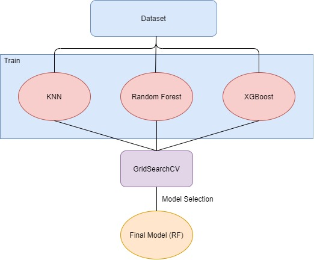
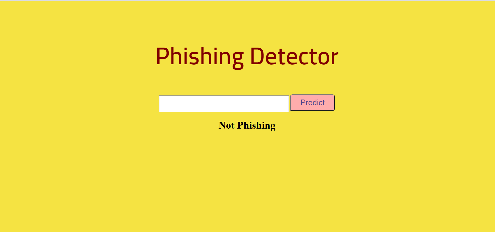

# Phishing-Detector

  

Internet and digital world are growing every day and everyone is becoming part of this world.
Because of this growth, everyday a new information or technology is entering this world. Most
people can’t track these new developments and they become target for deceiving.[1] By creating
similar websites to authentic sites, people are getting deceived and and their information is
stolen by the creators of these phishing websites. In this paper, a model has been proposed to
detect phishing websites by using machine learning methods. Machine learning was done using
a certain data set and the best model was selected because of testing more than one model.

## Methodology
When we first searched the literature, we chose the "Dataset for detect phishing" dataset that we found ready as our training and test data [2]. Then, after making the necessary visualizations and analyzes on the data, we saw that there was no imbalance in the target feature and that there was not any missing values. After dropping the outliers that will have a bad effect on the model's learning, we divided our data into 3 parts as train, validation and test. Then we used grid search and cross validation for model selection. Trained 3 different algorithms (and Neural Nets.) with various parameters. We set paramaterer grids and use cross validation for avoid overfitting. We use precision and recall rather than accuracy. Because accuracy not always gives best results. In Precision and recall, precision is the fraction of relevant instances among the retrieved instances, while recall is the fraction of relevant instances that were retrieved [3]. Both precision and recall are therefore based on relevance. Formula of this is precision times recall divided by precision plus recall values.It shows how much your program works properly.  

**Here is the structure of our models:**

## Results
After the grid search CV we choose the best performanced algorithm which is Random Forest Classifier. Actually all algorithms gave good performances including Neural Nets. But we choose best one which is Random Forest Classifier.

**Here is the Precision and Recall Scores of Algorithms**

| Algorithm                     | Precision | Recall|
|----------------------------|---------------|-------------|
| Random Forest Classifier            |      0.954       |      0.954      |
| XGBoost Classifier          |          0.930     |      0.929      |
| KNeighbors Classifier          |       0.881       |      0.880      |

Also we deploy our model using Heroku and Flask. Here is the interface of our web deployment.

**Here is the demo link for deployment**: https://predicting-phishing-or-not.herokuapp.com/

## References

[1] Jagatic, T. N., Johnson, N. A., Jakobsson, M., & Menczer, F. (2007). Social phishing. Communications of the ACM, 50(10), 94-100.

[2] Vrbančič, G., Fister Jr, I., & Podgorelec, V. (2020). Datasets for phishing websites detection. Data in Brief, 33, 106438.

[3] Buckland, M., & Gey, F. (1994). The relationship between recall and precision. Journal of the American society for information science, 45(1), 12-19.

This repository is created by [Ozgur Dogan](https://github.com/ozgurdogan646), [Gulcin Betul Cetres](https://github.com/gulcinbetulcetres) and [Okan Bagriacik](https://github.com/OkanBagriacik).
